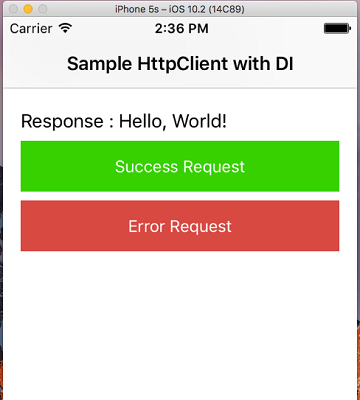
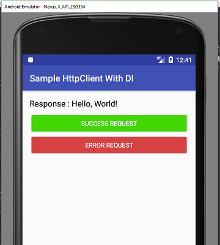

# Sample Http Client With Dependency Injection

I want common structure for android and ios platforms.
This repository is an android project.
I have used [Dagger 2](https://google.github.io/dagger/android.html) library for dependency injection in this repository.
I like Dagger 2.

All right, show me code.

## Declaring Http Client Interface

I need a http client on both platforms. Their methods and parameter's names should be same.

**For Android;**
```java
public interface HttpClient {
    void get(String path, HttpSuccessListener successListener, HttpErrorListener errorListener);
    void post(String path, Map<String, String> params, HttpSuccessListener successListener, HttpErrorListener errorListener);
    void put(String path, Map<String, String> params, HttpSuccessListener successListener, HttpErrorListener errorListener);
    void delete(String path, HttpSuccessListener successListener, HttpErrorListener errorListener);
}
```

**For iOS (swift);**
```swift
protocol HttpClient  {
    func get(path: String,  onSuccess: @escaping (_ result: String?) -> Void, onError: @escaping (_ statusCode: Int, _ message: String?, _ error: Error) -> Void) -> Void
    func post(path: String, params: [String:String], onSuccess: @escaping (_ result: String?) -> Void, onError: @escaping (_ statusCode: Int, _ message: String?, _ error: Error) -> Void) -> Void
    func put(path: String, params: [String:String], onSuccess: @escaping (_ result: String?) -> Void, onError: @escaping (_ statusCode: Int, _ message: String?, _ error: Error) -> Void) -> Void
    func delete(path: String, params: [String:String], onSuccess: @escaping (_ result: String?) -> Void, onError: @escaping (_ statusCode: Int, _ message: String?, _ error: Error) -> Void) -> Void
}
```

Okay, everything is all right.

## Implementing Http Client

I created a class with "DefaultHttpClient" name. I was implements httpclient interface.
I have used [volley library](https://developer.android.com/training/volley/index.html) for networking operations in this project.

```java
public class DefaultHttpClient implements HttpClient {

    private final String baseUrl;
    private final RequestQueue requestQueue;

    public DefaultHttpClient(Context context, String baseUrl) {
        requestQueue = Volley.newRequestQueue(context);
        this.baseUrl = baseUrl;
    }

    @Override
    public void get(String path, HttpSuccessListener successListener, HttpErrorListener errorListener) {
        request(Request.Method.GET, path, null, successListener, errorListener);
    }

    @Override
    public void post(String path, Map<String, String> params, HttpSuccessListener successListener, HttpErrorListener errorListener) {
        request(Request.Method.POST, path, params, successListener, errorListener);
    }

    @Override
    public void put(String path, Map<String, String> params, HttpSuccessListener successListener, HttpErrorListener errorListener) {
        request(Request.Method.PUT, path, params, successListener, errorListener);
    }

    @Override
    public void delete(String path, HttpSuccessListener successListener, HttpErrorListener errorListener) {
        request(Request.Method.DELETE, path, null, successListener, errorListener);
    }

    private void request(int method, String path, Map<String, String> params, final HttpSuccessListener successListener, final HttpErrorListener errorListener) {
        ...
    }
}
```

## Dependency Injection With Dagger 2 Library

Yess. I have used dagger 2 library for dependency injection. I declared an Application Module. I provided http client in the module.
HttpClient is singleton in application lifecycle.

[Dagger 2 documentation](https://google.github.io/dagger/android.html)

**ApplicationModule;**

```java
@Module
public class ApplicationModule {
    private final App app;

    public ApplicationModule(App app) {
        this.app = app;
    }

    @Singleton
    @Provides
    public Context context() {
        return app.getApplicationContext();
    }

    @Singleton
    @Provides
    public HttpClient httpClient(Context context) {
        return new DefaultHttpClient(context, "http://www.mocky.io/v2/");
    }
}
```

## How we use HttpClient?

### In Android Project

**Inject HttpClient;**

```java
@Inject
HttpClient httpClient;
```

**Make Request With HttpClient;**

```java
httpClient.get("5904e13e10000015194f671f", result -> {

    messageLabel.setText(String.format("Response : %s", result));

}, (statusCode, errorMessage, error) -> {

    messageLabel.setText(String.format("StatusCode : %s) \nError Message : %s", statusCode, errorMessage));

});
```

### In iOS Project

**Inject HttpClient (swift);**

```swift
// Injected HttpClient
var httpClient : HttpClient!
```

**Make Request With HttpClient (swift);**

```swift
httpClient.get(path: "5904e13e10000015194f671f", onSuccess: { (result) in

    self.messageLabel.text = "Response : \(result ?? "")"

}, onError: { (statusCode, errorMessage, error) in

    self.messageLabel.text = "StatusCode : \(statusCode) \nError Message : \(errorMessage ?? "")"
})
```

### Screenshots in project

 

### Happy Codings (: